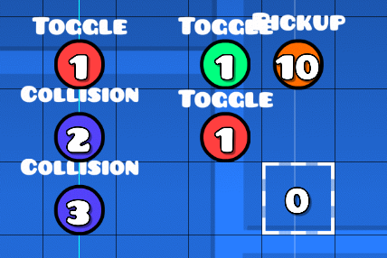
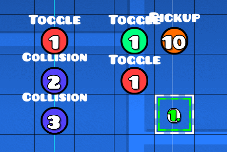

# Geometry Dash 2.1 Remote Code Execution

This was discovered by me and a few others in the Geometry Dash community, starting May 27th of 2022, and was developed further by me into this repo.

# Setup

For this to work, you need a frame counter on item ID 10. The setup is shown below:

The inner collision block has a block ID of 1 and a group ID of 1. The outer one has a block ID of 0. The left toggle trigger disables group 1. Both collision triggers have BlockA ID 0 and BlockB ID 1. The first triggers on exit and activates group 2, while the second doesn't trigger on exit and activates group 3.

On the right, there is a toggle trigger activating group 1, with a group ID of 2, and another deactivating group 1 with a group ID of 3. Both are spawn triggered and multi-trigger. The pickup trigger increments item ID 10 by 1 and has group IDs 2 and 3, and is spawn triggered and multi-trigger.

Then, simply run the build script (`b.sh`) and it will add the RCE into your latest level. **Do not open the level in the editor**, as it'll crash your game due to the invalid data. Running `clean.py` will clean the latest level, removing the RCE from it and making it safe to open in the editor (note that this clears the guidelines).

# Notes

This uses a specific version of gd.py (which is also patched), as others don't work with the weird encoding manipulation we do with the strings.

# [Writeup?](./writeup.md)

[Writeup!](./writeup.md)
